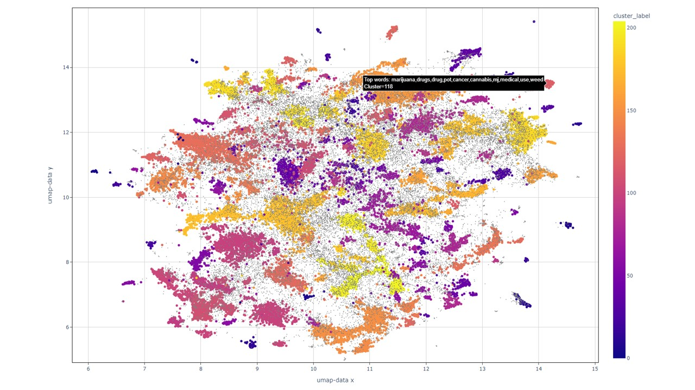

# Text clustering and labeling
Simple analysis of text posts from a forum to visualize topics from unlabeled data. The following steps are included:

1. Preprocessing:
Initial data preparation involves preprocessing, including the removal of hyperlinks to ensure data cleanliness.

1. Tokenization:
Utilizing the BERT tokenizer (tokenizer = BertTokenizer.from_pretrained("bert-base-uncased")), the text is segmented into chunks with a maximum token length of 256. This is undertaken to avoid truncation issues downstream in the analysis pipeline.

1. Sentence Embeddings:
Employing the BERT-based model (model = SentenceTransformer('all-MiniLM-L6-v2')), sentence embeddings are computed to capture semantic information inherent in the text.

1. Dimensionality Reduction:
Subsequently, dimensionality reduction is performed using UMAP (Uniform Manifold Approximation and Projection) to distill the high-dimensional sentence embeddings into a more manageable form. UMAP preserves local and global trends.

1. Clustering:
Employing HDBSCAN (Hierarchical Density-Based Spatial Clustering of Applications with Noise), the reduced-dimensional data is clustered to unveil latent topics within the text posts. HDBSCAN is density based and is thus not sensitive to cluster shape, does not require predefined number of clusters and leaves datapoints unclassified where density is not high enough.

1. Cluster Labeling:
Each cluster is labeled based on the identification of the most frequent words within that cluster after lemmatization with Spacy ("en_core_web_sm")

1. Visualization:
Finalized clusters are visualized using UMAP, reducing the dimensionality to two dimensions for enable presentation.

1. Saving results:
Results and parameters for each run are saved in new folder

  
# Example output
50000 blog posts clustered into 200 categories and labeled with 10 top words for each.

